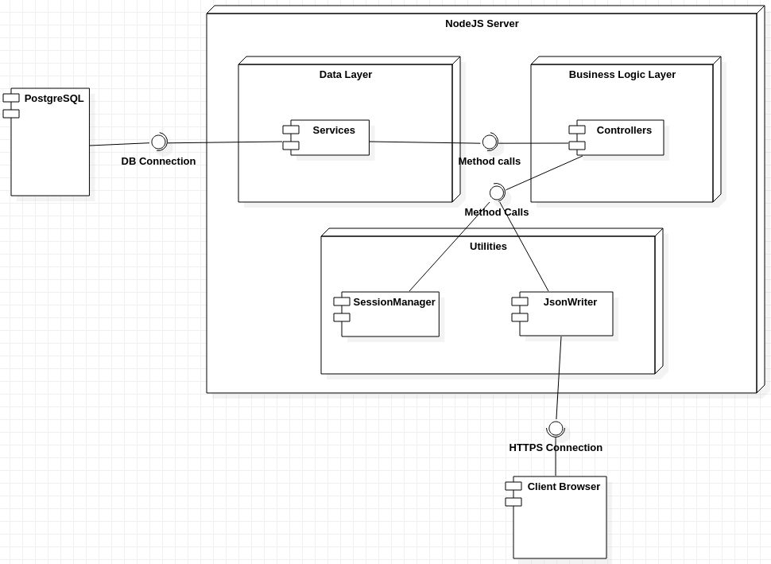
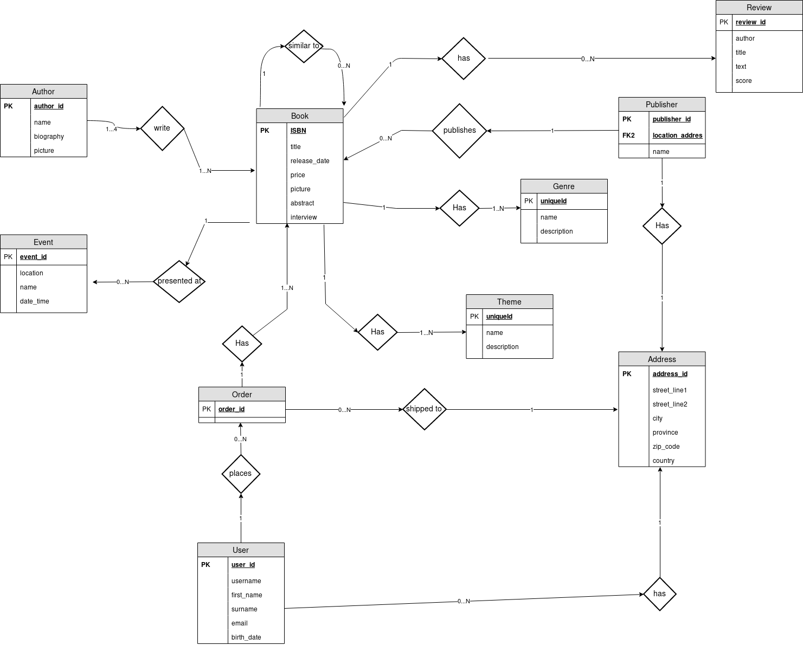

# Documentation of the Backend part

> Deliverable D1

## General group information

| Member n. | Role | First name | Last Name | Matricola | Email address |
| --------- | ------------- | ---------- | --------- | --------- | --------------- |
| 1 | administrator | Luca | Maltagliati | 919858 | luca.maltagliati@mail.polimi.it |
| 2 | member | Marco | Turetta | 921188 | marco3.turetta@mail.polimi.it |
| 3 | member | Alessandro | Carughi | 915626 | alessandro.carughi@mail.polimi.it |

## Links to other deliverables
- Deliverable D0: the web application is accessible at
[this
address](https://bookhub-ctm.herokuapp.com/).
- Deliverable D2: the YAML or JSON file containing the specification of the app
API can be found at [this
address](https://bookhub-ctm.herokuapp.com/backend/spec.yaml).
- Deliverable D3: the SwaggerUI page of the same API is available at
[this
address](https://bookhub-ctm.herokuapp.com/docs).
- Deliverable D4: the source code of D0 is available as a zip file at
[this address](https://bookhub-ctm.herokuapp.com/backend/app.zip).
- Deliverable D5: the address of the online source control repository is
available [this
address](https://github.com/malta895/hypermedia-project/).
We hereby declare that this
is a private repository and, upon request, we will give access to the
instructors.
## Specification
### Web Architecture
**Describe here, with a diagram, the components of your web application and how
they interact. Highlight which parts belong to the application layer, data layer
or presentation layer. How did you ensure that HTML is not rendered server side?**

Our web application serves statically the folder containing the html pages and other assets such as scripts, images and style sheets; all the other data is produced by the backend in JSON format, then is retrieved and rendered on the pages by the client JavaScript code. By following this pattern we are sure that HTML code is never rendered server-side.

### API
#### REST compliance
Describe here to what extent did you follow REST principles and what are the
reasons for which you might have decided to diverge. Note, you must not describe
the whole API here, just the design decisions.

We did follow the following REST principles:

* **Statelessness**: Every request contains all the informations needed to perform the request. There are some request who require authentication: in this case the client must send the cookie containing the session token to authenticate himself. However, for security and performance reasons, we store session data on the server, so there is no need to repeatedly access to the database during an user's session.

* **Uniform interfaces**: Every component in the web server always follow the same rules to communicate with each other: in our project, controllers always call the corresponding method on the corresponding services, retrieve the data, call the JSON generator function that finally sends data to the client. 
All the URIs follow the same naming convention (for example, all requests regarding books start with /books, and so on), response codes follow HTTP conventions (200 for succesful response, 404 when resource is not found, 401 if the client fails authorization and so on so forth) and finally all the requests methods are coherent with the actual operation carried out when this specific request is invoked, as specified by [HTTP methods conventions](https://developer.mozilla.org/en-US/docs/Web/HTTP/Methods).

* **Layered System**: Every component interacts transparently to the others: also, every component has its well-defined task: the modularity of the application obtained in this way makes it easier to understand and to extend or modify the single components of the systems without worrying about the others.

* **Client-Server**: Client and server can evolve separately: there is no dependency on the technologies used under the hood in these two components; client only knows URIs to get the resources and server sends them transparently with a standard representation (JSON in our case).

#### OpenAPI Resource models

**Describe here synthetically, which models you have introduced for resources.**

- **User**: Contains relevant information about a user registered to the application.
- **Cart**: List of items that a User is willing to buy. Contains the list of Book instances and the total amount
- **Book**: All the informations about a book.
- **Amount**: An amount of money.
- **Currency**: Currency referred to an instance of Amount.
- **Author**: The author of a book; includes its name, a photo and, optionally, a biography.
- **Address**: An address, used in many contexts inside the application.
- **Event**: Contains all relevant informations about an event in wich a book is presented.
- **Publisher**: The publisher or editor of a Book
- **Genre**: A genre of a book
- **Theme**: A theme of a book
- **Review**: The review of a book, that a user can write.
- **Order**: An Order made by a user. Contains relevant informations such shipping address, total price and payment method.

### Data model
**Describe with an ER diagram the model used in the data layer of your web
application. How these map to the OpenAPI data model?**

All of the entities in the diagram above are mapped to their counterparts in the API specification. Of course in the database we added relation tables for the 1-N and N-N relations.

## Implementation
### Tools used

**Describe here which tools, languages and frameworks did you use for the backend
of the application.**

We used Swagger framework to generate the OpenAPI specs and code skeleton of our web server. 
The backend is written in JavaScript on NodeJS version 10.6.

Among the others, we used the following npm packages:

- (express)[https://www.npmjs.com/package/express], to route the requests to the server

- [express-session](https://www.npmjs.com/package/express), to manage session and authenti
cation with cookies;

- [KnexJS](https://knexjs.org/), to build queries and to interface to the database;

- [bcrypt](https://www.npmjs.com/package/bcrypt), to encrypt password and store their hashed representation on the database, for security reasons;

- [bluebird](https://www.npmjs.com/package/bluebird), an alternative *Promise* implementation;

- [sanitize-html](https://www.npmjs.com/package/sanitize-html), to clean input text from potentially dangerous HTML (and JavaScript) code, as a countermeasure towards CSRF and XSS attacks.

### Discussion

- **How did you make sure your web application adheres to the provided OpenAPI
specification?**

We made it sure by carefully following the documentation found on [swagger.io](swagger.io). We used the tool provided on this website to generate the APIs and to make sure that our specification had no errors. 

- **Why do you think your web application adheres to common practices to partition
the web application (static assets vs. application data)**

Our applications contains all the static assets in a single folder, *public/*, that is served statically and accessible on the root of the application. APIs endpoints are accessible at *api/*. The folders are organized exactly as generated by Swagger, plus the folder other

- **Describe synthetically why and how did you manage session state, what are the
state change triggering actions (e.g., POST to login etc..)**

For managing session we used the npm package express-session, which transparently allows to generate a cookie based session by providing a secret string used to encrypt the cookie. A session object is then provided, we wrote a wrapper around it with getters and setters, to avoid conflicts while modifying it and also to make the application more modular. 
The session data is saved in the *req.session* object; to map each session to the corresponding clients we set an attribute to the *req.session* object named as the sessionID. This allows multiple users access at the same time on different clients, as a website is supposed to behave.

- **Which technology did you use (relational or a no-SQL database) for managing
the data model?**

We used the ORDBMS database PostgreSQL, as suggested by our backend instructor. 
We exploited many functionalities offered by this system, by making extensive use of triggers, constraints and views. We decided to adopt this approach for three main reasons: 
- Triggers, constraints and foreign keys guarantee coherence of data, avoiding the introduction of errors after inserting or updating rows. This made programming the server easier,and allowed to detect consinstency errors by checking the error message returned from the database (e.g. we could easily detect username conflicts and notify them to the client).

- Some of the business logic is moved to the database, where some kind of operations is more efficient. This also reduces code complexity on the server. (e.g. the average rating of a book is calculated on the database by a trigger)
- Views make the queries more simple and readable, avoiding long and repetitive queries in the services scripts.

We interfaced it to the NodeJS environment using the [Knex.js](https://knexjs.org/) library.

## Other information
### Task assignment

- Luca: Worked on back-end and OpenAPI Specs 70% of the time; front-end scripts and rendering 20% of the time, documentations on 10%

- Marco: Worked on backend and OpenAPI Specs 20% of the time, front-end scripts and rendering 70%, documentations 10%

- Alessandro: Worked on front-end 70% of the time, documentations and site evaluation 30% of the time.

### Analysis of existing API
**Describe here if you have found relevant APIs that have inspired the OpenAPI specification and why (at least two).**

We took inspiration from OneDrive RESTful APIs for the endpoints URI naming conventions; some of us have prevuosly worked with Telegram Bot APIs, so this helped on understanding how an RESTful API is structured.

### Learning outcome
What was the most important thing all the members have learned while developing
this part of the project, what questions remained unanswered, how you will use
what you've learned in your everyday life?

Luca: In this course I learned to use technologies I have never used before: NodeJS, Swagger and PostgreSQL. The will certainly be useful in my future career as software engineer.

Alessandro: In this course I learned how a website can be more accessible and useful to an user. I also enriched my knowledge in the technologies used in front-end development.

Marco: I learnt many new things on JavaScript, Jquery and bootstrap. These technologies are widely used in web development industry, so for sure they will be of help on my future informatic career.
